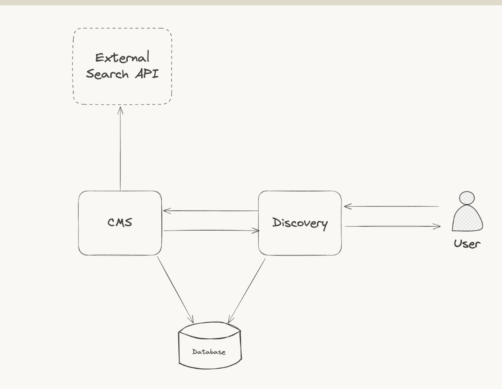

# NestJS CMS + Discovery (Fastify)

A podcast content management system built with NestJS and Fastify⚡️. This monorepo features two specialized applications: a CMS for content creators and administrators, and a MVP Discovery API for public content consumption. Both apps share a unified PostgreSQL database.

## Architecture



The system consists of:
- **CMS App** - Admin API for content management
- **Discovery App** - Public API for content browsing  
- **Shared Database** - PostgreSQL with TypeORM
- **External Search API** - Placeholder structure only (Algolia/Elasticsearch adapters not implemented)

## 🏗️ Project Structure

```
├── apps/
│   ├── cms/          # Admin app for content management
│   └── discovery/    # Public app for content browsing
├── libs/
│   ├── common/       # Shared utilities and DTOs
│   ├── database/     # TypeORM entities and migrations
│   └── search/       # Search abstraction (Algolia/Elasticsearch)
└── types/            # Shared TypeScript types
```

## Quick Start

```bash
npm install
cp .env.sample .env
docker compose up -d
npm run typeorm:run

# Start applications
npm run start:cms        # CMS Admin
npm run start:discovery  # Public Discovery
```

## API Documentation

- **CMS API**: http://localhost:3001/docs
- **Discovery API**: http://localhost:3002/docs

Both apps include comprehensive Swagger documentation with interactive API testing.

## Frontend Development

### For Customer App Developers (Discovery API)

```javascript
// Fetch all series with pagination
const response = await fetch('http://localhost:3002/browse/series?limit=10&offset=0');
const series = await response.json();

// Search episodes by title or description
const searchResults = await fetch('http://localhost:3002/browse?q=searchterm&limit=10');
const episodes = await searchResults.json();

// Get specific episode details
const episode = await fetch('http://localhost:3002/browse/episodes/ba15a12e-f003-52a3-9dc0-dc675d6db010');
const episodeData = await episode.json();
```

**Key Endpoints:**
- `GET /browse?q=searchterm` - Search episodes by title/description
- `GET /browse/series` - List all series (supports pagination)
- `GET /browse/series/:id` - Get series details with episodes
- `GET /browse/episodes` - List all episodes (supports pagination)  
- `GET /browse/episodes/:id` - Get episode details with chapters

### For Admin Panel Developers (CMS API)

The CMS API provides full CRUD operations for managing podcast content across three main resources:
- Series
- Episodes
- Chapters


### Available Endpoints:

**Series Management:**
- `GET /series` - List all series
- `GET /series/:id` - Get specific series
- `POST /series` - Create new series
- `PATCH /series/:id` - Update series
- `DELETE /series/:id` - Delete series

**Episodes Management:**
- `GET /episodes` - List all episodes
- `GET /episodes/:id` - Get specific episode
- `POST /episodes` - Create new episode
- `PATCH /episodes/:id` - Update episode
- `DELETE /episodes/:id` - Delete episode

**Chapters Management:**
- `GET /chapters` - List all chapters
- `GET /chapters/:id` - Get specific chapter
- `PATCH /chapters/:id` - Update chapter
- `DELETE /chapters/:id` - Delete chapter

**Key Features:**
- Complete CRUD operations for all content types
- Swagger documentation with examples
- Hierarchical content structure (Series → Episodes → Chapters)
